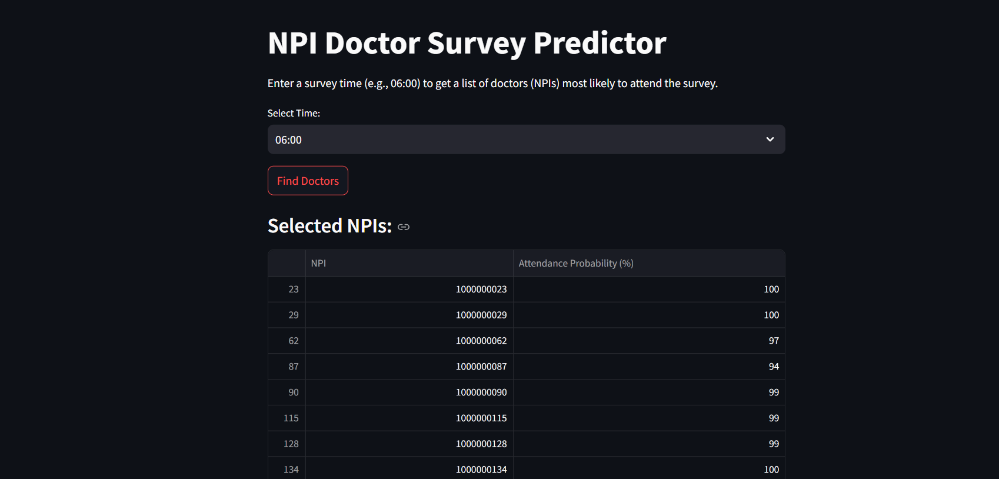
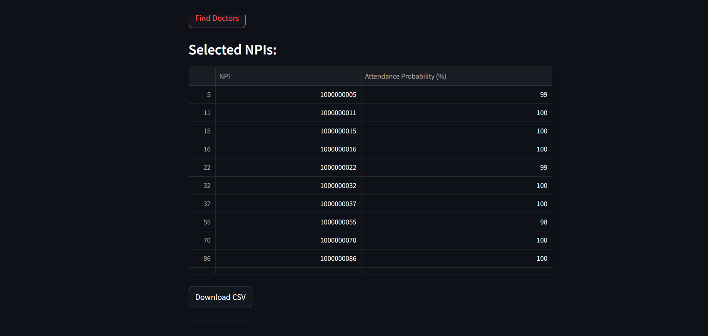

# NPI Doctor Survey Predictor



## 📌 Overview
The **NPI Doctor Survey Predictor** is an AI-powered tool designed to predict which doctors (NPIs) are most likely to participate in a survey based on their past activity. Instead of sending survey invitations to all doctors, this system helps optimize engagement by targeting only the most probable participants.

## ✨ Features
- 📊 **Predicts doctor survey attendance** based on login patterns, usage time, and survey attempts.
- 🕒 **Time-based filtering** allows selecting doctors active around a specific time.
- 📄 **Exports results** as a downloadable CSV file.


- 🖥️ **Interactive web app** built with **Streamlit**.

## 🚀 Tech Stack
- **Python** (pandas, scikit-learn, openpyxl)
- **Machine Learning** (Random Forest Classifier)
- **Streamlit** (for UI & interaction)

## 📂 Project Structure
```
npi-doctor-survey-predictor/
├── data/                      # Contains the dataset (Excel file)
├── notebooks/                 # Jupyter notebook for EDA
├── src/                       # Source code
│   ├── data_preprocessing.py  # Data cleaning and preprocessing
│   ├── model.py               # ML model training & prediction
│   ├── filter.py              # Logic to filter doctors by time & probability
│   ├── utils.py               # Helper functions
├── app/                       # Streamlit app
│   ├── app.py                 # Main app file
│   ├── requirements.txt       # Dependencies for the app
├── README.md                  # Project documentation
├── requirements.txt            # Overall project dependencies
└── .gitignore                  # Ignore unnecessary files
```

## 🔧 Installation & Setup
1️⃣ **Clone the Repository:**
```bash
git clone https://github.com/your-username/npi-doctor-survey-predictor.git
cd npi-doctor-survey-predictor
```

2️⃣ **Install Dependencies:**
```bash
pip install -r requirements.txt
pip install -r app/requirements.txt
```

3️⃣ **Run the Web App:**
```bash
streamlit run app/app.py
```

## 🛠️ Usage
1. Open the web app in your browser.
2. Select a time (e.g., 06:00 AM) to find doctors most likely to attend at that time.
3. Click **Find Doctors** to view results.
4. Download the recommended list as a CSV file.

## 🎯 Example Output
| NPI         | Attendance Probability (%) |
|------------|---------------------------|
| 1000000001 | 87%                        |
| 1000000002 | 72%                        |
| 1000000003 | 65%                        |

## 🌐 Deployment
To deploy this app on **Streamlit Cloud**, follow these steps:
1. Push your code to GitHub.
2. Go to [Streamlit Community Cloud](https://share.streamlit.io/).
3. Click **New App**, select your repository, and deploy.

## 📜 License
This project is licensed under the **MIT License**.

## 🤝 Contributing
Contributions are welcome! Feel free to **fork** the repo and submit a **pull request**.

---

⭐ **If you like this project, consider starring the repo!** ⭐
